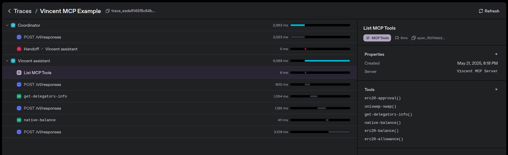

# OpenAI Agent Kit <> Vincent MCP

This repository shows how to integrate the Vincent MCP with the OpenAI Agent Kit.

## Setup

1. Copy `.env.example` into `.env`
2. Complete your OpenAI API key
3. Fill the MCP values for the type of server you will be using, either STDIO or HTTP
4. Run `python run_stdio.py` or `python run_http.py` choosing which type of MCP server your have setup previously

### Local Vincent MCP setup

Check [Vincent repo](https://github.com/LIT-Protocol/Vincent) and its [mcp package](https://github.com/LIT-Protocol/Vincent/tree/main/packages/mcp) for setup instructions.

# Running

After completing setup you can run `python run_stdio.py` or `python run_http.py` depending on the type of MCP server you want.

The output of the script will be something similar to this considering the variability of LLMs

```shell
View trace: https://platform.openai.com/traces/trace?trace_id=<trace_123...>

Running: Check who my delegators are and then check the native balance in base blockchain of the first one.
Your first delegator is:

- **Token ID**: 0x25cde13de35b4ae0bdde4f1a3c910eae236201e8776a182ca0092fcf9495004e
- **ETH Address**: 0x2b0e8EBA44FE6Fdc87dE6ADfa3367417D97Fd22f
- **Public Key**: 0x0490f9499c818c3ca1bc7b04fcaa8ceea9f1e3861e7bdddcbbd968a7eb2b74450f98434c0f71a18b2b28fdd2b79b9452bb9cd00281874d0e757599e2a7ea9a21c0

The native balance on the Base blockchain for this delegator is **0.00249632539384409** ETH.
```

And checking the trace in the OpenAI link should output how all the agents coordinated and executed each step like the following screenshot.



You can see how first agent delegated to the second one, who has the necessary tools and that one executed what it needed to before getting to the end result.
